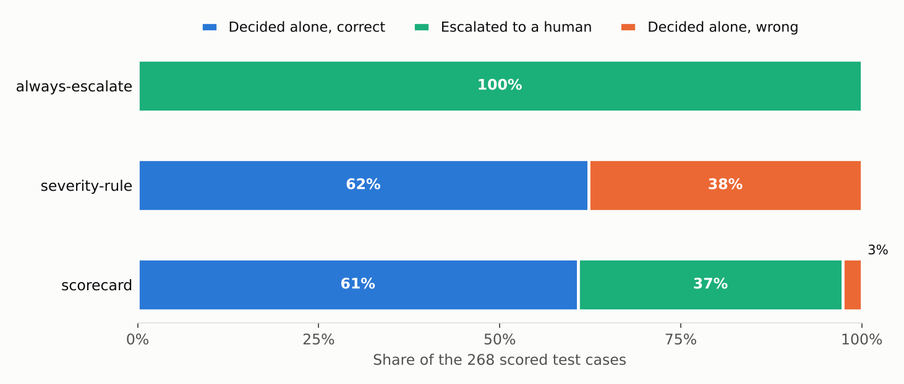
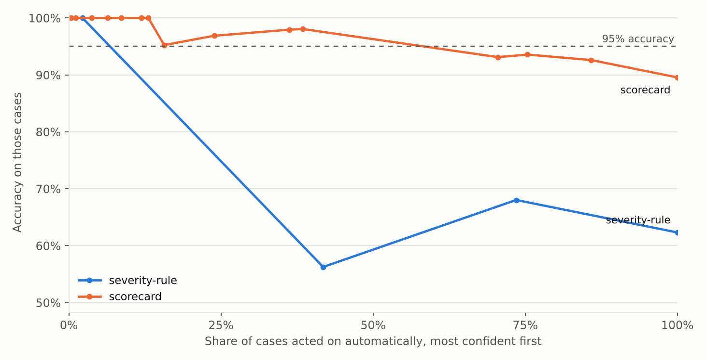
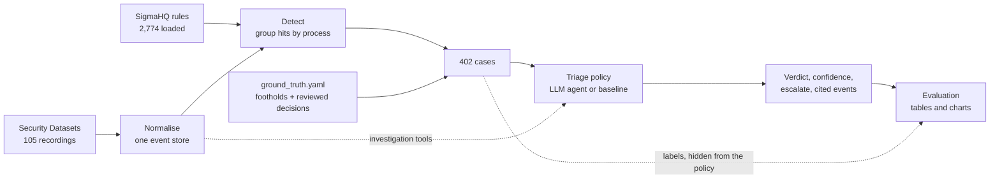

# SOC alert triage agent, and how far to trust it

An agent that investigates security alerts on real Windows telemetry, gives a verdict with cited
evidence, and hands the case to a human when it is unsure. The agent is the smaller half of this
repository. The larger half is the evaluation harness that answers the question a team has to
answer before shipping one:

> **How often is the verdict right, and does it escalate the cases it would have got wrong?**

Everything is built from public data at pinned commits, runs for free on a desktop, and every
number in this README is produced by a command you can run.

## What is here

| | |
|---|---|
| **Telemetry** | 770,705 real Windows events from 105 attack-simulation recordings in [Security Datasets](https://github.com/OTRF/Security-Datasets) (Sysmon, Security, PowerShell logs) |
| **Detections** | The public [SigmaHQ](https://github.com/SigmaHQ/sigma) rule set, unmodified: 2,774 rules loaded, 224 of them fired |
| **Benchmark** | 402 triage cases (241 malicious, 146 benign, 15 set aside as ambiguous), each with a written reason for its label |
| **Agent** | A tool-using LLM agent (7 investigation tools) that runs on a local model through Ollama or on any OpenAI-compatible endpoint |
| **Baselines** | Always escalate, trust rule severity, and a hand-written evidence checklist: the "no AI" competitors |
| **Evaluation** | Verdict accuracy, missed attacks, escalation quality, an accuracy-versus-coverage curve, evidence grounding, and cost per case |

The cases are not easy to tell apart by looking at the alert. 72 of the 241 malicious cases tripped
only low-severity rules, and 18 benign cases tripped high-severity ones. Some of the benign ones:
the Azure VM agent reading LSASS memory, a configuration-management run that queries the domain
password policy, a monitoring agent launching a script host as SYSTEM.

## Results

<!-- results:start -->
Scored on the **test** split: 268 cases (164 malicious, 104 benign) from 68 recordings. Ranges in brackets are 95% intervals from resampling whole recordings.

| Policy | Auto-resolved | Accuracy when it decides | Attacks auto-closed as benign | Benign auto-raised as attack | Accuracy if forced to decide all |
|---|---|---|---|---|---|
| `always-escalate` | 0% (0 to 0) | n/a | 0 of 164 (0.0%) | 0 of 104 (0.0%) | 61% (50 to 73) |
| `severity-rule` | 100% (100 to 100) | 62% (52 to 71) | 87 of 164 (53.0%) | 14 of 104 (13.5%) | 62% (52 to 71) |
| `scorecard` | 63% (55 to 71) | 96% (93 to 98) | 5 of 164 (3.0%) | 2 of 104 (1.9%) | 90% (85 to 94) |



**Does it know when it does not know?**

| Policy | Escalated | Escalated cases it would have got wrong | Auto-resolved cases it got wrong | Share of its errors that escalation caught | Auto-resolvable at 95% accuracy |
|---|---|---|---|---|---|
| `always-escalate` | 100% | 39% | n/a | 100% | 0% |
| `severity-rule` | 0% | n/a | 38% | 0% | 2% |
| `scorecard` | 37% | 21% | 4% | 75% | 38% |



**Cost and grounding**

| Policy | Tool calls per case | Seconds per case | Tokens per case (in / out) | Cited events that were really shown | Investigations that failed |
|---|---|---|---|---|---|
| `always-escalate` | 0.0 | 0.00 | 0 / 0 | cites nothing | 0 |
| `severity-rule` | 0.0 | 0.00 | 0 / 0 | 100% of 527 | 0 |
| `scorecard` | 0.0 | 0.00 | 0 / 0 | 100% of 527 | 0 |
<!-- results:end -->

**How to read this.**

- `severity-rule` is what sorting the queue by rule severity gets you: it closes more than half of
  the real attacks as benign. Severity is the rule author's guess, not evidence.
- `scorecard` is a serious baseline. It resolves about six cases in ten on its own at 96% accuracy
  and sends the rest to a human. Its escalations are useful: the cases it escalates are five times
  more likely to be ones it would have got wrong.
- Where the checklist fails is specific. Every attack it closed as benign is a **Windows service
  doing the attacker's work**: the Task Scheduler registering a task the attacker created remotely,
  the kernel writing a DLL the attacker dropped over SMB. The process is legitimate and the parent
  chain is clean. The only way to get these right is to follow the artifact to where it came from,
  which is an investigation, not a checklist. That is the gap an agent has to close to earn its place.

**The LLM agent's row is not in the table yet.** Nothing in this repository is reported unless it
was measured, and that run needs a model. It is one command (see
[Run the agent](#run-the-agent-on-a-local-model)); `python -m triage report` then adds the row and
redraws both charts. Full breakdowns, including every wrong verdict and why the truth is what it
is, are in [results/RESULTS_test.md](results/RESULTS_test.md).

## One case, start to finish

This is what the agent is handed for case C0324. Two low-severity rules, a SYSTEM service, a task
under `\Microsoft\Windows\`, and a rule author who says false positives are "likely":

```text
CASE C0324
Host: workstation6
Process the case is about:
  image: C:\Windows\System32\svchost.exe        user: NT AUTHORITY\SYSTEM
Detection rules that fired (2):
- [low] Scheduled Task Created - Registry (ATT&CK: T1053.005; fired 14x)
    false positives the rule author expects: Likely as this is a normal behaviour on Windows
Events that fired the rules:
[E571501] 12:00:22.232 registry key event: HKLM\...\Schedule\TaskCache\Tree\Microsoft\Windows\SoftwareProtectionPlatform\EventCacheManager
[E571522] 12:00:22.248 file created: C:\Windows\System32\Tasks\Microsoft\Windows\SoftwareProtectionPlatform\EventCacheManager
```

The checklist baseline closes it as benign with 0.78 confidence. It is an attack. One call to
`search_events` for the task name shows why:

```text
[E571460] 12:00:22.190 process created: schtasks /create /F /tn \Microsoft\Windows\SoftwareProtectionPlatform\EventCacheManager
          /tr "C:\Windows\system32\cmd.exe /C C:\Windows\System32\notepad.exe" /sc ONSTART /ru system /S WORKSTATION6   (host workstation5)
[E571531] 12:00:22.264 security event 4698: SubjectUserName=pgustavo, TaskName=\Microsoft\Windows\SoftwareProtectionPlatform\EventCacheManager
[E571519] 12:00:22.238 security event 4624: TargetUserName=pgustavo, LogonType=3, IpAddress=172.18.39.5
```

A user on another workstation created the task remotely, to run as SYSTEM at start-up, and named it
to look like a Windows licensing task. `python -m triage show C0324` prints any case with every
policy's investigation next to the ground truth.

## How it works



**A case** is one process on one host plus every rule that fired on it. Grouping by process is how
an analyst thinks about it, and it stops one noisy process from counting eight times.

**The agent** gets the alert and seven tools: `process_info`, `process_events`, `host_timeline`,
`search_events`, `get_event`, `prevalence` and `attack_technique`. On each turn it replies with one
JSON object, a tool call or a final verdict, so it works with small local models that have no native
function calling. A final verdict carries a best guess, a confidence, an escalate flag, a summary,
and the event numbers it relies on. An investigation that breaks (bad output, a tool loop, a backend
error) is escalated, never silently closed.

**What the agent cannot see.** The recording name states the attack technique, so it never leaves
the harness. Every tool is bound to the case's own recording. Labels and label reasons are stripped
before the case is handed over, and a test checks that.

**Grounding is checked, not assumed.** Every event shown to the agent is recorded. A cited event
that was never shown counts as a fabricated citation and is reported.

## The benchmark

Labels are not a list someone typed. They are derived, on every build, from
[`benchmark/ground_truth.yaml`](benchmark/ground_truth.yaml):

1. For each recording, the processes the simulated attacker controlled (its footholds), taken from
   the recording's own published description and attacker console transcript. A process that is a
   foothold or descends from one is **malicious**.
2. A reviewed decision, with a written reason, for every case ancestry cannot settle: processes the
   attacker started remotely, and system services carrying out the attacker's request.
3. Named patterns for routine activity that repeats across the lab machines (the Azure guest agent,
   the monitoring agent, configuration management, the Task Scheduler's own tasks): **benign**.

A case that matches nothing fails the build, so nothing is labeled by default. 15 cases where a
Windows component merely reacts to something the attacker started (for example `csrss.exe` opening a
handle to a new process) are labeled `side_effect` and left out of the scores, because reasonable
analysts disagree on them.

Recordings are split into **dev** (36 recordings, 119 scored cases) and **test** (69 recordings,
268 scored cases) by a hash of the recording name. The checklist's thresholds were tuned on dev
only, by a rule fixed in advance. Confidence intervals resample whole recordings, because cases from
the same recording are not independent. Details are in [docs/methodology.md](docs/methodology.md).

## Run it

Python 3.10 or newer. About 700 MB of disk for the downloaded data and the event store.

```bash
git clone https://github.com/harshinireddy2204/soc-alert-triage-agent
cd soc-alert-triage-agent
python -m venv .venv
.venv\Scripts\activate            # Windows.  macOS and Linux: source .venv/bin/activate
pip install -e ".[dev]"

python -m triage fetch            # 105 recordings + Sigma rules, pinned commits, checksums verified (about 60 MB)
python -m triage build            # event store, detection, labels (about 4 minutes)

python -m triage run scorecard    # also: severity-rule, always-escalate
python -m triage report           # tables, charts, and the Results section of this README
python -m triage show C0324       # one case, every policy's investigation, and the truth
pytest                            # 39 tests, no data needed
```

`build` reproduces `benchmark/cases.jsonl` byte for byte from the pinned sources.

### Run the agent on a local model

Free, and nothing leaves your machine. Install [Ollama](https://ollama.com), then:

```bash
ollama pull qwen2.5:7b
python -m triage run llm --model qwen2.5:7b --split dev --limit 10    # a quick look first
python -m triage run llm --model qwen2.5:7b                           # the 280 test cases
python -m triage report
```

A run saves each case as it finishes and resumes where it stopped. Any model Ollama serves works;
so does any OpenAI-compatible endpoint:

```bash
python -m triage run llm --backend openai --base-url https://your-endpoint/v1 --model your-model --api-key-env YOUR_KEY_VARIABLE
```

Each model's results go to their own file, so several models can sit side by side in the report.

## What this does not show

- **It is lab data.** The benign activity is operating-system, cloud-agent and monitoring noise, not
  administrators doing unusual but legitimate things. Production accuracy will be lower.
- **The mix is unrealistic.** 62% of scored cases are malicious. A real queue is mostly false
  positives, which is why the report gives missed attacks and wrongly raised alarms separately
  rather than leaning on accuracy.
- **One reviewer wrote the labels**, with rule-assisted review, and they have not been independently
  audited. The reasons are in the repository so that anyone can disagree with a specific call.
- **The checklist's score is optimistic.** Its signals were written by the same person who reviewed
  the labels. The dev/test split protects only its thresholds.
- **Scope.** Only detections that can be tied to a process become cases; 1,887 rule hits on Security
  and PowerShell records without a process link are left out (those logs stay available to the agent
  as evidence). 245 Sigma rules were not loaded: 150 are not Windows rules, 13 are informational, and
  the rest need log sources or features this evaluator does not implement. Skipped rules are counted
  in [`benchmark/build_info.json`](benchmark/build_info.json), never approximated.
- **Prevalence is weak here.** "How common is this" is computed across the other recordings, which
  are themselves attack simulations, so attacker tooling looks common. The tool says so.

## What I would build next

1. **Case-level correlation.** Several cases often belong to one intrusion. Triage them together and
   measure whether context from one case fixes verdicts on its neighbours.
2. **Cost-aware escalation.** A missed attack and a wasted analyst hour do not cost the same. Pick
   the escalation threshold from an explicit cost ratio and report the operating point.
3. **A second labeler** on a sample, to put a number on label agreement.
4. **Benign administrator activity**, the hardest negative class and the one this data lacks.
5. **Regression tracking.** Run the benchmark on every prompt or model change and fail the build
   when missed attacks go up.

## Repository map

```text
benchmark/   captures.yaml (sources + checksums), ground_truth.yaml, cases.jsonl, ATT&CK reference
src/triage/  sigma.py (rule evaluator)  corpus.py, build.py (ingest)  detect.py  labels.py
             tools.py, store.py (investigation)  agent.py, llm.py  baselines.py
             evaluate.py, report.py  cli.py
results/     saved runs and generated tables
tests/       39 tests that run without the data
docs/        methodology, charts
```

## Credits and licenses

Code: MIT. The data is not mine and is used under its own terms: Security Datasets by the Open
Threat Research Forge (MIT), SigmaHQ detection rules (Detection Rule License 1.1), and MITRE ATT&CK
(© The MITRE Corporation, reproduced with permission under its terms of use). See [NOTICE](NOTICE).
Rule titles, descriptions and authors are carried into every case.
